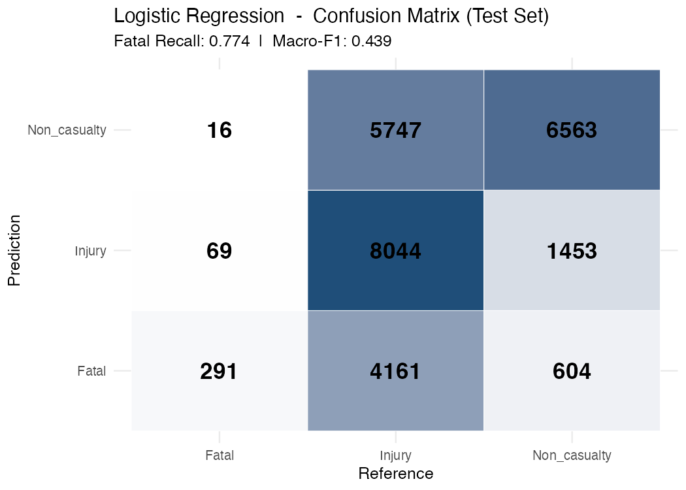
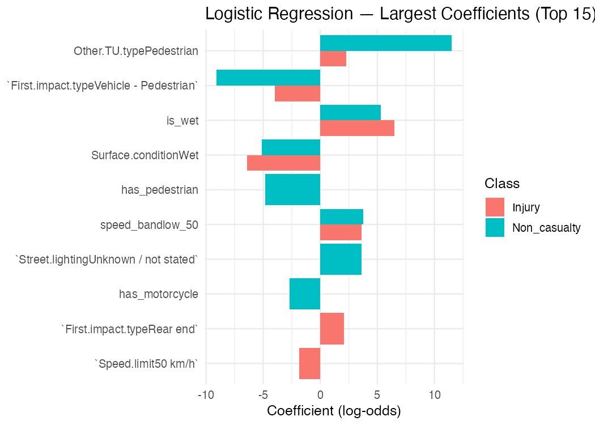
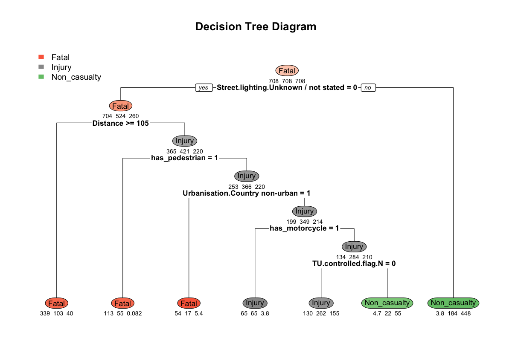
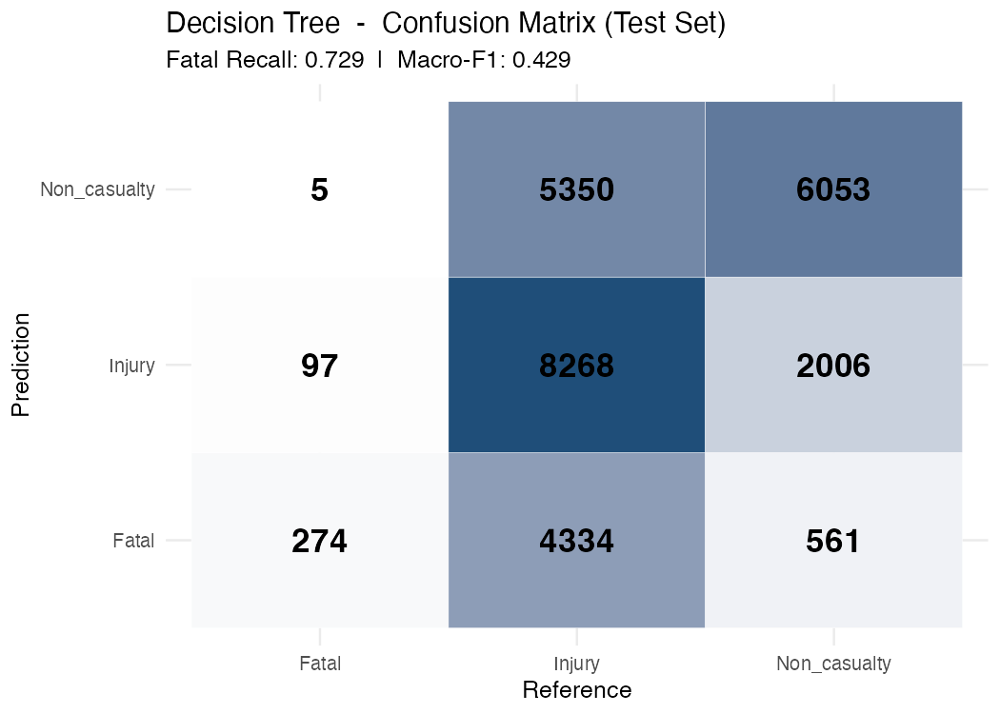
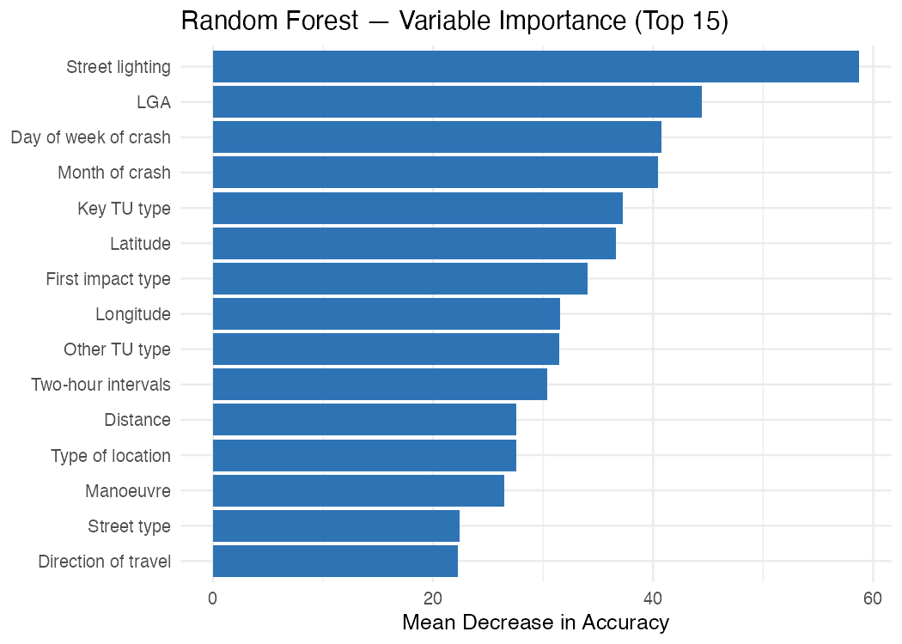
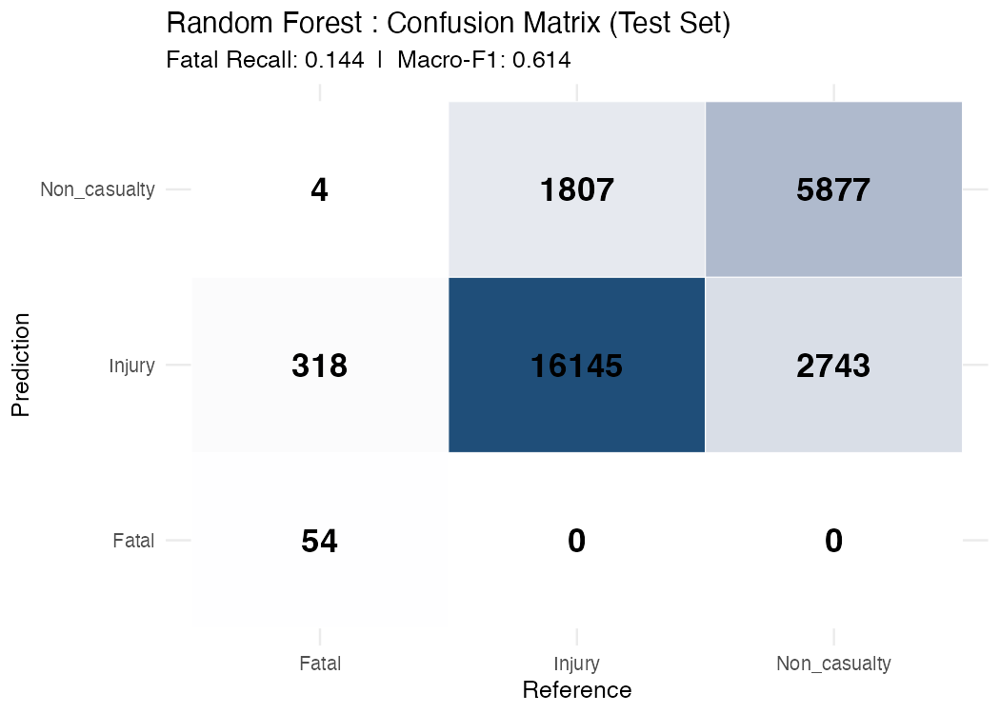

```{r setup, include=FALSE}
knitr::opts_chunk$set(echo = FALSE, message = FALSE, warning = FALSE,
                      fig.align = "center", out.width = "90%")

library(ggplot2)
library(dplyr)
library(readr)
library(forcats)
library(scales)
library(knitr)
library(kableExtra)
library(tidyr)
library(flextable)
```

```{r load-data, include=FALSE}
df_raw <- read_csv("nsw_road_crash_merged_2020_2024.csv", show_col_types = FALSE)

df_raw <- df_raw %>%
  rename(severity = `Degree of crash`) %>%
  mutate(severity = factor(severity,
    levels = c("Fatal", "Injury", "Non-casualty (towaway)"),
    labels = c("Fatal", "Injury", "Non-casualty")))
```

## Research Question & Motivation

**Research Question:**

> Given environmental conditions (weather, lighting, road surface, speed limit) 
> and traffic unit characteristics (TU type, manoeuvre, number of units), 
> can we predict NSW road crash severity **(Fatal / Injury / Non-casualty)**?
> - A three-class classification problem.

**Motivation:**

- NSW recorded **340 road fatalities in 2024**, over two-thirds in regional areas *(TfNSW, 2025)*
- Fatal crashes represent only **~1.4%** of all crashes : severe class imbalance
- A predictive model has direct value for:

| Stakeholder | Value |
|-------------|-------|
| **Traffic Authorities** | Targeted speed and road interventions |
| **Emergency Responders** | Faster, evidence-based resource allocation |
| **Policymakers & Insurers** | Precise policy and pricing decisions |

## EDA & Data Understanding: Dataset Overview

```{r dataset-overview-robert, echo=FALSE, message=FALSE, warning=FALSE}
total_records <- nrow(df_raw)
total_vars    <- ncol(df_raw)
class_counts  <- table(df_raw$severity)
class_props   <- round(prop.table(class_counts) * 100, 1)

overview <- data.frame(
  Item = c(
    "Time Period",
    "Data Sources",
    "Merge Key",
    "Total Records",
    "Total Variables",
    "Target Variable",
    "Fatal",
    "Injury",
    "Non-casualty"
  ),
  Detail = c(
    "2020 - 2024",
    "CRASH.xlsx + TRAFFIC UNIT.xlsx (TfNSW via data.gov.au)",
    "Crash ID (left join)",
    format(total_records, big.mark = ","),
    as.character(total_vars),
    "Degree of Crash (3-class classification)",
    paste0(format(class_counts["Fatal"], big.mark=","), 
           " (", class_props["Fatal"], "%)"),
    paste0(format(class_counts["Injury"], big.mark=","), 
           " (", class_props["Injury"], "%)"),
    paste0(format(class_counts["Non-casualty"], big.mark=","), 
           " (", class_props["Non-casualty"], "%)")
  )
)

flextable(overview) |>
  set_header_labels(Item = "Item", Detail = "Detail") |>
  theme_vanilla() |>
  bold(j = 1) |>
  bold(part = "header") |>
  bg(i = c(2, 4, 6), bg = "#f5f5f5") |>
  color(i = 7, j = 2, color = "#d62728") |>
  color(i = 8, j = 2, color = "#ff7f0e") |>
  color(i = 9, j = 2, color = "#2ca02c") |>
  fontsize(size = 16, part = "all") |>    
  fontsize(size = 18, part = "header") |> 
  padding(padding = 8, part = "all") |> 
  set_table_properties(width = 1) |>   
  autofit()
```

## EDA & Data Understanding: Class Imbalance

<div style="display:flex; align-items:flex-start; gap:20px;">
<div style="flex:0 0 58%;">
```{r class-imbalance-robert, echo=FALSE, message=FALSE, warning=FALSE, fig.width=5, fig.height=3.2}

class_dist <- df_raw %>%
  count(severity) %>%
  mutate(
    proportion = round(n / sum(n) * 100, 1),
    label = paste0(proportion, "%\n(n=", format(n, big.mark=","), ")")
  )

ggplot(class_dist,
       aes(x = severity, y = proportion, fill = severity)) +
  geom_bar(stat = "identity", width = 0.6) +
  geom_text(
    aes(label = label),
    vjust = -0.3,
    size  = 4,
    fontface = "bold"
  ) +
  scale_fill_manual(values = c(
    "Fatal"        = "#d62728",
    "Injury"       = "#ff7f0e",
    "Non-casualty" = "#2ca02c"
  )) +
  scale_y_continuous(limits = c(0, 75)) +
  labs(
    title    = "Class Distribution (2020-2024)",
    subtitle = "Fatal crashes severely underrepresented",
    x = "Severity Class",
    y = "Proportion (%)"
  ) +
  theme_minimal(base_size = 11) +
  theme(legend.position = "none")
```
</div>
<div style="flex:0 0 38%; padding-top:10px; font-size:14px;">

| Issue / Decision | Detail |
|:-----------------|:-------|
| **Class imbalance** | Fatal only ~1.4% of all crashes |
| **Risk of naive models** | Accuracy-maximising models ignore Fatal entirely |
| **Imbalance strategy** | Inverse-frequency class weights (all models) |
| **SMOTE** | Applied inside training fold only; synthetic Fatal share raised to ~10% in training |
| **Primary metrics** | Macro-F1 and Fatal Recall (target >= 0.50) |

</div>
</div>
## EDA & Data Understanding: Speed vs Severity


```{r slide-speed, fig.height=3.5}
speed_levels <- c("10 km/h","20 km/h","30 km/h","40 km/h","50 km/h",
                  "60 km/h","70 km/h","80 km/h","90 km/h","100 km/h","110 km/h")

df_raw %>%
  filter(`Speed limit` %in% speed_levels) %>%
  mutate(`Speed limit` = factor(`Speed limit`, levels = speed_levels)) %>%
  count(`Speed limit`, severity) %>%
  group_by(`Speed limit`) %>%
  mutate(prop = n / sum(n)) %>%
  ggplot(aes(x = `Speed limit`, y = prop, fill = severity)) +
  geom_col(position = "stack") +
  geom_hline(yintercept = 0.014, linetype = "dashed", colour = "white", linewidth = 0.8) +
  scale_fill_manual(values = c("Fatal" = "#d62728", "Injury" = "#ff7f0e", "Non-casualty" = "#2ca02c")) +
  scale_y_continuous(labels = percent_format(accuracy = 1)) +
  labs(title = "Crash Severity Proportion by Speed Limit",
       subtitle = "Fatal proportion rises sharply at 100-110 km/h  |  dashed line = overall Fatal baseline (~1.4%)",
       x = "Speed Limit", y = "Proportion of Crashes", fill = "Severity") +
  theme_minimal(base_size = 13) +
  theme(axis.text.x = element_text(angle = 45, hjust = 1), legend.position = "right")
```

> **Key finding:** Fatal proportion doubles at 100 km/h and triples at 110 km/h relative to 50 km/h zones - directly motivates `speed_band` feature engineering.

## EDA & Data Understanding: High-Risk Scenarios


```{r slide-highrisk, fig.height=3.8}
risk_table <- df_raw %>%
  filter(!is.na(`Speed limit`), !is.na(`Natural lighting`), !is.na(Urbanisation)) %>%
  group_by(`Speed limit`, `Natural lighting`, Urbanisation) %>%
  summarise(
    `Total Crashes` = n(),
    `Fatal %`       = mean(severity == "Fatal"),
    .groups = "drop"
  ) %>%
  filter(`Total Crashes` >= 200) %>%
  arrange(desc(`Fatal %`)) %>%
  slice_head(n = 10) %>%
  mutate(`Fatal %` = scales::percent(`Fatal %`, accuracy = 0.1)) %>%
  rename(`Speed Limit` = `Speed limit`, `Lighting` = `Natural lighting`)

kable(risk_table, align = c("l","l","l","r","r")) %>%
  kable_styling(full_width = TRUE, font_size = 13) %>%
  row_spec(0, bold = TRUE, background = "#2E74B5", color = "white") %>%
  row_spec(1:3, background = "#fce4e4") %>%
  column_spec(5, bold = TRUE, color = "#d62728")
```

> **Key finding:** Highest-risk scenarios all share 110 km/h + darkness + rural conditions - three features directly captured by `speed_band`, `is_night`, and `Urbanisation`.

## EDA & Data Understanding: Temporal Patterns


```{r slide-temporal, fig.height=3.5}
day_levels <- c("Monday","Tuesday","Wednesday","Thursday","Friday","Saturday","Sunday")

df_raw %>%
  mutate(`Day of week of crash` = factor(`Day of week of crash`, levels = day_levels),
         `Two-hour intervals`   = factor(`Two-hour intervals`,
                                          levels = unique(`Two-hour intervals`))) %>%
  group_by(`Day of week of crash`, `Two-hour intervals`) %>%
  summarise(count = n(), .groups = "drop") %>%
  ggplot(aes(x = `Two-hour intervals`, y = `Day of week of crash`, fill = count)) +
  geom_tile(colour = "white", linewidth = 0.4) +
  scale_fill_gradient(low = "#f0f4ff", high = "#1F4E79", labels = comma) +
  labs(title = "Crash Frequency by Day of Week and Two-Hour Interval",
       subtitle = "Morning (7-9 am) and evening (4-6 pm) commute peaks visible on weekdays",
       x = "Two-Hour Interval", y = NULL, fill = "Crash Count") +
  theme_minimal(base_size = 12) +
  theme(axis.text.x = element_text(angle = 45, hjust = 1),
        panel.grid = element_blank())
```

> **Key finding:** Volume peaks at weekday commute hours, motivating `is_rush_hour` and `is_weekend` features. Fatal *rate* (not count) is elevated on weekends and late-night hours.

## Data Preprocessing: Pipeline


**Steps 1-5: Cleaning & Feature Engineering**

1.  **TU Integration** - aggregated traffic-unit flags per crash (`has_motorcycle`, `has_heavy_vehicle`, `has_pedestrian`, `has_cyclist`) using `group_by + summarise + left_join`
2.  **Feature removal** - dropped leakage columns (post-crash injury counts), identifiers, and variables with \>75% missing values; dropped `Degree of crash - detailed` (redundant with target)
3.  **Imputation** - removed rows \>50% missing; categorical : `"Unknown"`; numeric : median
4.  **Feature engineering** - `is_weekend`, `is_rush_hour`, `is_night`, `is_wet`, speed bands - all motivated by EDA findings
5.  **Outlier handling** - NSW geographic bounds filter; winsorise `Distance` at 99th percentile

**Steps 6-9: Modelling Setup**

<ol start="6">
<li>**Encoding** - trees use native R `factor`; KNN/LR use one-hot; rare LGA levels : `"Other"`</li>
<li>**Scaling** - Z-score standardisation within fold for KNN; trees are scale-invariant</li>
<li>**Class imbalance** - inverse-frequency class weights (all models); SMOTE applied **inside training fold only**</li>
<li>**Split** - 2024 data sealed as temporal holdout; 80/20 stratified split on 2020-2023; 5-fold CV</li>
</ol>

## Data Preprocessing: Feature Engineering & Class Balancing


<div style="display:flex; align-items:flex-start; gap:20px;">
<div style="flex:0 0 63%;">

**Engineered features**  -  all motivated by EDA

<table style="font-size:12px; width:100%; border-collapse:collapse;">
<thead><tr style="background:#2E74B5; color:white;">
  <th style="padding:4px 7px;">Feature</th>
  <th style="padding:4px 7px;">Derivation</th>
  <th style="padding:4px 7px;">EDA motivation</th>
</tr></thead>
<tbody>
  <tr><td style="padding:3px 7px;"><code>speed_band</code></td><td style="padding:3px 7px;">Cut Speed limit: ≤50 / 60-80 / 90-100 / 110</td><td style="padding:3px 7px;">Fatal rate rises above 100 km/h</td></tr>
  <tr style="background:#f5f5f5;"><td style="padding:3px 7px;"><code>is_night</code></td><td style="padding:3px 7px;">Natural lighting in {Darkness, Dawn, Dusk}</td><td style="padding:3px 7px;">Dark conditions double fatal risk</td></tr>
  <tr><td style="padding:3px 7px;"><code>is_rush_hour</code></td><td style="padding:3px 7px;">Two-hour intervals in {7-9, 16-18}</td><td style="padding:3px 7px;">Commute peaks dominate crash volume</td></tr>
  <tr style="background:#f5f5f5;"><td style="padding:3px 7px;"><code>is_weekend</code></td><td style="padding:3px 7px;">Day of week in Saturday, Sunday</td><td style="padding:3px 7px;">Weekend crashes differ in severity</td></tr>
  <tr><td style="padding:3px 7px;"><code>is_wet</code></td><td style="padding:3px 7px;">Surface condition contains "Wet"</td><td style="padding:3px 7px;">Wet roads linked to skidding fatalities</td></tr>
  <tr style="background:#f5f5f5;"><td style="padding:3px 7px;"><code>has_motorcycle</code></td><td style="padding:3px 7px;">TU-level aggregated flag</td><td style="padding:3px 7px;">Motorcyclists over-represented in fatals</td></tr>
  <tr><td style="padding:3px 7px;"><code>has_pedestrian</code></td><td style="padding:3px 7px;">TU-level aggregated flag</td><td style="padding:3px 7px;">Pedestrian crashes nearly always severe</td></tr>
</tbody>
</table>
</div>
<div style="flex:0 0 33%; font-size:12px;">

**Handling class imbalance**

<table style="width:100%; border-collapse:collapse; font-size:12px;">
<thead><tr style="background:#2E74B5; color:white;">
  <th style="padding:4px 7px;">Issue</th><th style="padding:4px 7px;">Strategy</th>
</tr></thead>
<tbody>
  <tr><td style="padding:3px 7px;">Fatal only ~1.4%</td><td style="padding:3px 7px;">Naive models predict majority class only</td></tr>
  <tr style="background:#f5f5f5;"><td style="padding:3px 7px;">Class weights</td><td style="padding:3px 7px;">Inverse-frequency weights on all models</td></tr>
  <tr><td style="padding:3px 7px;">SMOTE</td><td style="padding:3px 7px;">Inside training fold only (LR, KNN); Fatal raised to ~10%</td></tr>
  <tr style="background:#f5f5f5;"><td style="padding:3px 7px;">Test set</td><td style="padding:3px 7px;">Unmodified  -  real-world distribution preserved</td></tr>
  <tr><td style="padding:3px 7px;">Primary metrics</td><td style="padding:3px 7px;">Macro-F1 + Fatal Recall (target ≥ 0.50)</td></tr>
</tbody>
</table>
</div>
</div>

## Model Fitting: Approach & Setup


We implemented six diverse classification models to balance interpretability and predictive power. All models were trained on the same stratified 50% subsample ($n \approx 55,000$) to ensure fair comparison.

| Model | R Package | Imbalance Strategy | Primary Hyperparameter |
|:---|:---|:---|:---|
| **Multinomial LR** | `nnet` | SMOTE (inside CV) | `decay` (L2 Penalty) |
| **Decision Tree** | `rpart` | Class Weights | `cp` (Complexity) |
| **Random Forest** | `randomForest` | Class Weights | `mtry` |
| **XGBoost** | `xgboost` | SMOTE / Weights | `nrounds`, `max_depth` |
| **KNN** | `kknn` | SMOTE (inside CV) | `k` (Neighbors) |
| **Naive Bayes** | `naive_bayes` | SMOTE (inside CV) | `laplace`, `usekernel` |

**Validation Strategy:**
- [cite_start]**Primary Metric:** Macro-F1 (robust to class imbalance)[cite: 14].
- [cite_start]**Constraint:** Fatal Recall $\geq$ 0.50 (safety-first approach)[cite: 50].
- [cite_start]**Method:** 5-fold Cross-Validation (OOB for Random Forest)[cite: 49].

*All models trained via `caret` with 5-fold CV. Primary metric: **Macro-F1**. Hard constraint: **Fatal Recall ≥ 0.50**.*

## Model Fitting: Logistic Regression


Logistic regression served as our **interpretable baseline** model. It helps show how key predictors are associated with crash severity, while also giving us a benchmark for comparing more flexible models.

<div style="display:flex; align-items:flex-start; gap:16px;">
<div style="flex:0 0 52%;">

</div>
<div style="flex:0 0 44%;">


<table style="font-size:12px; width:100%; border-collapse:collapse; margin-top:6px; text-align:left;">
<thead><tr style="background:#2E74B5; color:white;">
  <th style="padding:4px 8px;">Metric</th><th style="padding:4px 8px; text-align:right;">Value</th>
</tr></thead>
<tbody>
  <tr><td style="padding:3px 8px;">Macro-F1</td><td style="padding:3px 8px; text-align:right;">0.4395</td></tr>
  <tr style="background:#f5f5f5;"><td style="padding:3px 8px; color:#d62728;"><b>Fatal Recall</b></td><td style="padding:3px 8px; text-align:right; color:#d62728;"><b>0.7739</b></td></tr>
  <tr><td style="padding:3px 8px;">Weighted F1</td><td style="padding:3px 8px; text-align:right;">0.5914</td></tr>
  <tr style="background:#f5f5f5;"><td style="padding:3px 8px;">Kappa</td><td style="padding:3px 8px; text-align:right;">0.2724</td></tr>
</tbody>
</table>

<p style="font-size:11px; text-align:left; margin:0; line-height:1.2; background:#f9f9f9; padding:6px; ">
  <b>Key message:</b> High coefficients for <b>Pedestrians</b>, <b>Night-time</b>, and <b>Non-urban</b> areas prove our baseline LR successfully prioritises the minority class.
</p>
</div>
</div>

## Model Fitting: Decision Tree


Decision Tree was included because it produces clear **if-then style rules**, making it easier to explain the model to a non-technical audience. It reveals hierarchical relationships between risk factors.

<div style="display:flex; align-items:flex-start; gap:16px;">
<div style="flex:0 0 54%;">

</div>
<div style="flex:0 0 42%; text-align:center;">


<table style="font-size:12px; width:100%; border-collapse:collapse; margin-top:6px; text-align:left;">
<thead><tr style="background:#2E74B5; color:white;">
  <th style="padding:4px 8px;">Metric</th><th style="padding:4px 8px; text-align:right;">Value</th>
</tr></thead>
<tbody>
  <tr><td style="padding:3px 8px;">Macro-F1</td><td style="padding:3px 8px; text-align:right;">0.4290</td></tr>
  <tr style="background:#f5f5f5;"><td style="padding:3px 8px; color:#d62728;"><b>Fatal Recall</b></td><td style="padding:3px 8px; text-align:right; color:#d62728;"><b>0.7287</b></td></tr>
  <tr><td style="padding:3px 8px;">Weighted F1</td><td style="padding:3px 8px; text-align:right;">0.5837</td></tr>
  <tr style="background:#f5f5f5;"><td style="padding:3px 8px;">Kappa</td><td style="padding:3px 8px; text-align:right;">0.2430</td></tr>
</tbody>
</table>

<p style="font-size:10.5px; text-align:left; margin:0; line-height:1.2; background:#f9f9f9; padding:6px; ">
  <b>Key message:</b> The tree identifies <b>Street Lighting</b> and <b>Distance</b> as the primary root splits. Using heavy class weights ensures the model actively searches for Fatal outcomes, satisfying safety constraints.
</p>
</div>
</div>

## Model Fitting: Random Forest


<div style="display:flex; align-items:flex-start; gap:16px;">
<div style="flex:0 0 54%;">

</div>
<div style="flex:0 0 42%; text-align:center;">

<table style="font-size:12px; width:100%; border-collapse:collapse; margin-top:6px; text-align:left;">
<thead><tr style="background:#2E74B5; color:white;">
  <th style="padding:4px 8px;">Metric</th><th style="padding:4px 8px; text-align:right;">Value</th>
</tr></thead>
<tbody>
  <tr><td style="padding:3px 8px;">OOB Error Rate</td><td style="padding:3px 8px; text-align:right;">18.4%</td></tr>
  <tr style="background:#f5f5f5;"><td style="padding:3px 8px;">Macro-F1</td><td style="padding:3px 8px; text-align:right;">0.614</td></tr>
  <tr><td style="padding:3px 8px; color:#d62728;"><b>Fatal Recall</b></td><td style="padding:3px 8px; text-align:right; color:#d62728;"><b>0.144</b></td></tr>
  <tr style="background:#f5f5f5;"><td style="padding:3px 8px;">Weighted F1</td><td style="padding:3px 8px; text-align:right;">0.813</td></tr>
  <tr><td style="padding:3px 8px;">Kappa</td><td style="padding:3px 8px; text-align:right;">0.583</td></tr>
</tbody>
</table>
<p style="font-size:11px; text-align:left; margin-top:6px;"><b>Top predictors:</b> Street lighting, LGA, Day of week, Month  -  environmental context dominates vehicle type.</p>
</div>
</div>

## Model Fitting: XGBoost


```{r results-xgb, fig.height=3.5}
# TODO: [member name] - variable importance (by Gain) + training loss curve + confusion matrix
# Train on: df_train | CV: cv_ctrl | Evaluate on: df_test
```

## Model Fitting: KNN & Naive Bayes


```{r results-knn-nb, fig.height=3.5}
# TODO: [member name] - k vs Macro-F1 curve (KNN) + side-by-side confusion matrices
# KNN: cv_ctrl_smote | NB: cv_ctrl_smote | Evaluate both on: df_test
```

## Model Improvement: Hyperparameter Tuning


```{r slide-improvement}
tuning_tbl <- tibble::tibble(
  Model       = c("Logistic Regression", "Decision Tree", "Random Forest",
                  "XGBoost", "KNN", "Naive Bayes"),
  Parameter   = c("decay", "cp (complexity)", "mtry",
                  "nrounds / max_depth / eta", "k (neighbours)", "usekernel / laplace"),
  `Search Range` = c("0 to 0.1",
                     "0.001 to 0.01",
                     "tuneRF: 4, 6, 9, 13",
                     "nrounds: 50-200 | depth: 3-6 | eta: 0.01-0.3",
                     "5, 11, 21, 31, 51",
                     "kernel: T/F | laplace: 0, 0.5, 1"),
  `Best Value`       = c("0.01", "0.01*", "mtry = 13",  "TODO", "TODO", "TODO"),
  `Macro-F1 Before`  = c("0.440", "0.429", "0.614",      "TODO", "TODO", "TODO"),
  `Macro-F1 After`   = c("0.442", "0.429*", "0.634",      "TODO", "TODO", "TODO"),
  `Fatal Recall After` = c("0.761", "0.729*", "0.181",    "TODO", "TODO", "TODO")
)

kable(tuning_tbl, booktabs = TRUE) %>%
  kable_styling(full_width = TRUE, font_size = 12) %>%
  row_spec(0, bold = TRUE, background = "#2E74B5", color = "white") %>%
  row_spec(3, background = "#eaf3fb") %>%
  column_spec(1, bold = TRUE)
```

> RF: `tuneRF` identified **mtry = 13** (default = 6) - Macro-F1 +0.020, Fatal Recall +0.037. OOB converges before 75 trees.

## Model Evaluation


```{r slide-evaluation}
eval_tbl <- tibble::tibble(
  Model          = c("Logistic Regression (tuned)", "Decision Tree (baseline)", "Random Forest (tuned)",
                     "XGBoost", "KNN", "Naive Bayes"),
  `Macro-F1`     = c("0.442", "0.429", "**0.634**", "TODO", "TODO", "TODO"),
  `Fatal Recall` = c("0.761", "0.729", "0.181",     "TODO", "TODO", "TODO"),
  `Weighted F1`  = c("0.591", "0.584", "0.815",     "TODO", "TODO", "TODO"),
  `Kappa`        = c("0.272", "0.243", "0.590",     "TODO", "TODO", "TODO"),
  `Meets Fatal Recall >= 0.50` = c("Yes", "Yes", "No", "TODO", "TODO", "TODO")
)

kable(eval_tbl, booktabs = TRUE, escape = FALSE) %>%
  kable_styling(full_width = TRUE, font_size = 13) %>%
  row_spec(0, bold = TRUE, background = "#2E74B5", color = "white") %>%
  row_spec(3, background = "#eaf3fb") %>%
  column_spec(1, bold = TRUE) %>%
  column_spec(3, color = ifelse(eval_tbl$`Fatal Recall` == "TODO", "grey50", "#d62728"))
```

## Model Selection


```{r slide-selection}
# TODO: [member name] - best model name, justification, top predictors from variable importance
```

## Final Results & Conclusion


```{r slide-conclusion}
# TODO: [member name] - answer to RQ, key findings, practical implications for stakeholders
```

## Reflection & Future Directions


```{r slide-reflection}
# TODO: [member name] - limitations, future research directions
```

